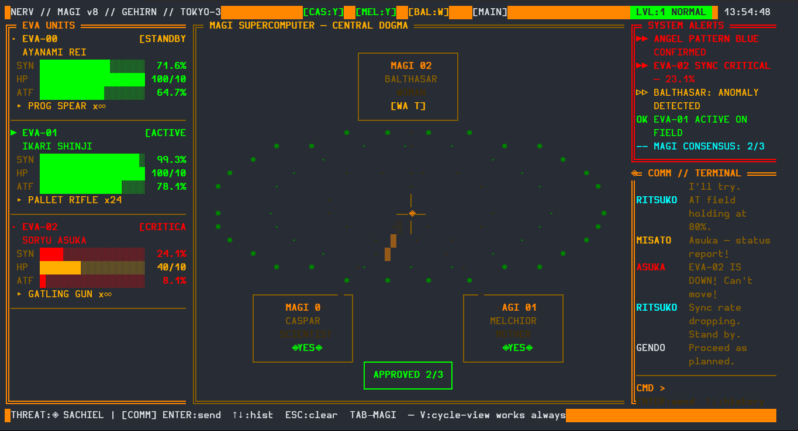
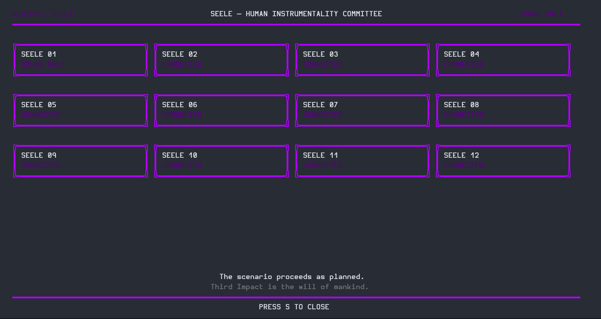
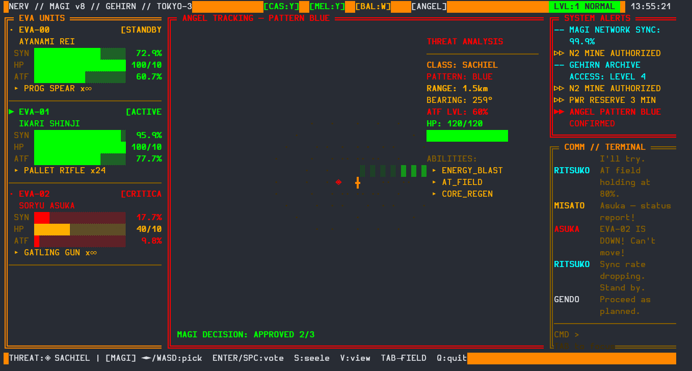

# ⚡ NERV MAGI SYSTEM v8.0 — Terminal User Interface (TUI)

🚀 **Overview**  
NERV MAGI TUI is a fully interactive Terminal User Interface (TUI) inspired by the NERV supercomputer system from *Neon Genesis Evangelion*. Built in Python, it runs in your terminal and simulates EVA unit control, tactical combat, and MAGI system operations.

---

## 📸 Screenshots

  
  
  
